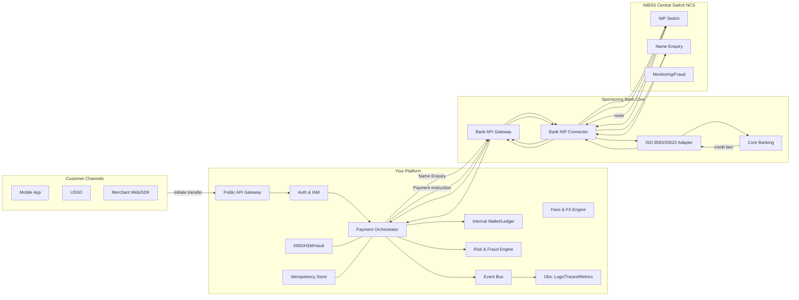
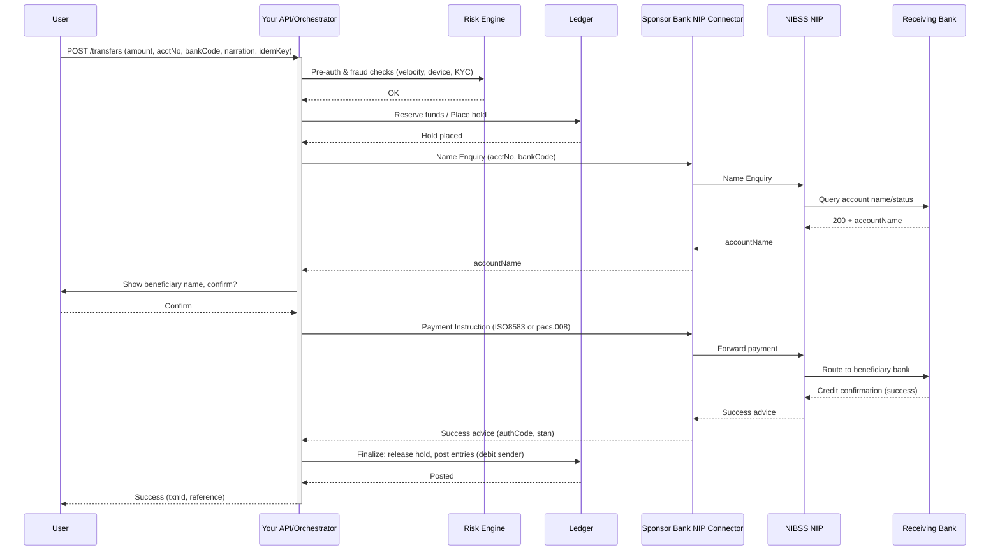

# NIBSS Instant Payments (NIP) — Full Technical Architecture

> This doc gives an end‑to‑end architecture for integrating NIBSS NIP via a sponsoring bank or direct (for licensed FIs). Includes diagrams, sequence flows, API contracts, idempotency/retry, security, monitoring, settlement & reconciliation.

---

## 0) Legend & Assumptions

* **You** = Fintech/PSP Platform
* **SB** = Sponsoring Bank (your direct counterparty)
* **NCS** = NIBSS Central Switch (NIP)
* **CBN‑RTGS** = CBN Real‑Time Gross Settlement (end‑of‑day settlement)
* All calls over mutual TLS; messages are signed; idempotency key used on every payment instruction.
* Message formats: legacy ISO‑8583 (widely used) and/or ISO‑20022 pain/pacs for newer stacks (NPS).

---

## 1) High‑Level Component Diagram

---

## 2) End‑to‑End Sequence (Happy Path)

---

## 3) Error Paths & Reversal Logic (Essentials)

**Common failure modes**

1. **Timeout at RB**: Bank doesn’t respond within SLA (e.g., 15s). → Treat as *unknown*. Keep **hold** on funds, poll Advice/Query Status, or auto‑reverse after T+X minutes if no settlement advice.
2. **Debit success, credit fail**: Your SB returns failure after debit. → Trigger **automatic reversal**; release hold only after reversal confirmation.
3. **Duplicate requests**: Same idemKey re‑sent. → Must be **idempotent**; return prior result.
4. **Name Enquiry mismatch**: Name mismatch above threshold. → Require user re‑confirmation or block.

**Reconciliation strategy**

* Online: immediate status via Advice/Query API.
* EOD: match **your ledger** ↔ **SB file** ↔ **NIBSS report**; investigate exceptions.

---