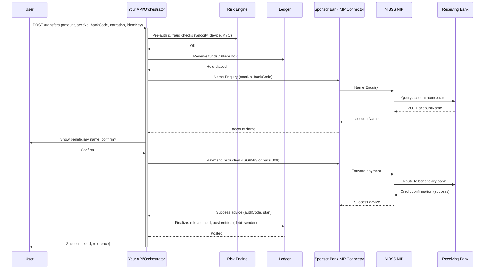

# Definition and Concept of Fintech

## 1. What is Fintech?
**Fintech** is short for **Financial Technology** — the use of innovative technologies to deliver, improve, or automate financial services and processes.  
It merges **finance** and **technology** to create solutions that are:
- Faster
- More accessible
- More efficient
- Often cheaper than traditional methods

---

## 2. Core Idea
Fintech leverages:
- **Digital infrastructure** (cloud computing, mobile platforms)
- **Data analytics** (AI/ML for personalization and risk management)
- **Secure integrations** (APIs, blockchain)
- **Regulatory compliance frameworks** (KYC, AML, PCI DSS)

This enables individuals, businesses, and institutions to conduct financial activities **anytime, anywhere** without relying solely on traditional banks.

---

## 3. Key Characteristics of Fintech
- **Digital-first**: Services are primarily accessed via mobile apps, websites, or APIs.
- **User-centric**: Focuses on seamless customer experience and personalization.
- **Innovative**: Constantly adopting new technologies like blockchain, AI, and biometrics.
- **Inclusive**: Brings financial services to underbanked and unbanked populations.
- **Data-driven**: Uses analytics to make better decisions and detect fraud.

---

## 4. Scope of Fintech
Fintech covers a broad range of financial services, including:
- Payments and money transfers
- Lending and credit scoring
- Digital banking (neobanks)
- Wealth management and robo-advisory
- Insurance technology (insurtech)
- Regulatory technology (regtech)
- Cryptocurrency and blockchain services
- Embedded finance in non-financial apps

---

## 5. How Fintech Works – Simplified Flow
User → Digital Interface (App/Web/API) → Financial Backend (Banking/Payments) → Compliance & Security → Service Delivery

- **User**: Individual or business needing a financial service.
- **Digital Interface**: Mobile app, web platform, or integrated API.
- **Backend**: Financial institutions, payment processors, or blockchain networks.
- **Compliance & Security**: Ensuring transactions meet legal and security requirements.
- **Service Delivery**: Execution of payments, loans, investments, etc.

---

## 6. Benefits of Fintech
- **Speed**: Instant transactions and approvals.
- **Cost Efficiency**: Reduced fees compared to traditional banks.
- **Accessibility**: Services available 24/7 globally.
- **Financial Inclusion**: Reaches rural and underserved areas.
- **Customization**: Personalized offers based on user data.

---

## 7. Challenges in Fintech
- **Regulatory hurdles**: Varies by country and service type.
- **Security risks**: Fraud, hacking, and data breaches.
- **Trust issues**: Users may be skeptical of non-bank financial providers.
- **Technology dependency**: Requires reliable internet and device access.

---

## 8. The Future of Fintech
Trends shaping fintech include:
- **Artificial Intelligence (AI)** for fraud detection and personal finance recommendations.
- **Blockchain** for decentralized finance (DeFi) and transparent transactions.
- **Open Banking** allowing secure data sharing between financial institutions and apps.
- **Central Bank Digital Currencies (CBDCs)** for government-backed digital money.
- **Biometric authentication** for secure, passwordless transactions.


# Loan System

## 1. Overview
A **loan system** in fintech allows users (individuals or businesses) to borrow money digitally, often with faster approval times, flexible terms, and AI-driven credit assessments.

Fintech loan systems can be:
- **Peer-to-Peer (P2P)** – Borrowers get funds directly from individual investors via a platform.
- **Institution-Backed** – Loans are funded by a bank or licensed lender integrated with the fintech app.
- **Hybrid Models** – Combination of both.

---

## 2. Core Workflow

### Step 1: Loan Application
- User selects loan type (personal, business, microloan, BNPL).
- Inputs details:
  - Loan amount
  - Repayment period
  - Purpose of loan
- Uploads required documents (ID, income proof) — sometimes optional for microloans.

---

### Step 2: Identity Verification (KYC)
- System verifies:
  - Government ID
  - Phone number/email
  - Bank account ownership
- Uses **KYC APIs** (e.g., Smile Identity, Onfido).

---

### Step 3: Credit Assessment
- **Traditional approach**: Uses credit bureau score.
- **Fintech approach**: AI/ML scoring using:
  - Transaction history
  - Mobile money data
  - Social and behavioral data
- Generates a **risk profile**.

---

### Step 4: Loan Offer
- Based on credit assessment, the system generates:
  - Approved amount
  - Interest rate
  - Repayment schedule
- User reviews and accepts terms (digital contract signing).

---

### Step 5: Disbursement
- Funds sent directly to:
  - User's bank account
  - Mobile wallet
- Triggered via payment API (e.g., Paystack, Flutterwave, ACH, instant bank transfer).

---

### Step 6: Repayment Tracking
- Loan system tracks repayment schedule:
  - Due dates
  - Partial payments
  - Penalties for late payments
- Reminders sent via SMS, email, or push notifications.

---

### Step 7: Loan Closure
- Once repayment is complete:
  - Loan status marked as **Closed**.
  - Credit score updated (if integrated with bureau).
  - User becomes eligible for higher loan limits.

---

## 3. Technical Architecture

### Components
1. **Frontend (Web/Mobile App)**
   - Loan application form
   - Loan status dashboard
2. **Backend Services**
   - Loan management system (LMS)
   - Risk scoring engine
   - Payment integration
3. **Databases**
   - User profiles
   - Loan records
   - Payment history
4. **External Integrations**
   - KYC/AML services
   - Payment gateways
   - Credit bureau APIs

---

## 4. Types of Loan Products in Fintech
- **Personal Loans**
- **Business Loans**
- **Microloans**
- **Buy Now Pay Later (BNPL)**
- **Salary Advance Loans**
- **Education Loans**

---

## 5. Compliance Considerations
- Must follow local lending regulations.
- Ensure transparent interest rates and fees.
- Maintain data privacy (GDPR, NDPR).
- Prevent fraud with advanced monitoring.

---

## 6. Advantages of a Fintech Loan System
- **Speed:** Approvals in minutes.
- **Accessibility:** Serves unbanked and underbanked.
- **Automation:** AI-powered decision making.
- **Scalability:** Can process thousands of applications simultaneously.


# POS Systems - Overview and Products

## What Is a POS System?

A **POS (Point of Sale)** system refers to:

1. **Agent Banking Terminals** — provided by fintechs/banks to agents for:
   - Withdrawals (card to cash)
   - Deposits
   - Transfers
   - Airtime/Data/Cable/Utility payments
   - BVN linking or verification
   - Mini statements & account openings (some advanced setups)

2. **Retail POS Systems** — used in stores for:
   - Scanning products
   - Inventory/sales management
   - Accepting card/mobile payments

3. **Soft POS** — smartphone-based POS (no hardware needed)

---

## What Can You Build With a POS System?

You can build a **whole stack of fintech or retail-tech products**.

### 1. Agency Banking Platform
- Recruit and manage field agents
- Fund wallets, set commissions, track transactions
- Build on APIs from Moniepoint, Opay, Baxi, PalmPay, Kudi, etc.
- You can white-label their POS terminals or embed their SDKs

**Product Example**: Agent dashboard + mobile app for float top-up, disputes, onboarding new agents

---

### 2. Retail POS (Merchants)
- Inventory and sales management
- Accept cards, USSD, QR, transfers
- Issue receipts
- Sync sales online (cloud dashboard)

**Product Example**: A POS app for supermarkets, restaurants, or salons with sales reports and staff management

---

### 3. Bill Payments & Airtime Reseller App
Use the POS device to:
- Sell airtime/data
- Pay utility bills (PHCN, DSTV)
- Generate recharge PINs
- Take customer deposits/payments via card

You can tap into **bill aggregator APIs** (like VTPass) and bundle this as a POS-based resale business.

---

### 4. Cash Collection for Field Agents
Great for:
- Cooperatives
- Insurance field reps
- Microfinance institutions
- Thrift/contribution collectors (ajo/esusu)

**Product Example**: Agent use POS to collect daily savings, syncs with user account in cloud/Mobile app.

---

### 5. Offline Payments / QR Payment App
POS can support:
- Offline card payments (via stored tokens)
- QR scanning (NQR, Flutterwave, Paystack)
- Contactless (NFC on supported devices)

---


# Payroll System

## 1. Overview
A **payroll system** automates the process of calculating, managing, and disbursing employee salaries.  
In fintech applications, payroll can be integrated with banking APIs, tax systems, and compliance modules to enable **fast, accurate, and compliant** salary payments.

---

## 2. Core Workflow

### Step 1: Employee Onboarding
- Capture employee details:
  - Full name
  - Contact info
  - Bank account details
  - Tax Identification Number (TIN)
  - Employment contract and salary structure
- Store securely in payroll database.

---

### Step 2: Data Collection for Payroll Period
- Gather:
  - Attendance records
  - Work hours
  - Overtime hours
  - Bonuses and commissions
  - Deductions (tax, pensions, loans)
- Sources:
  - HR system
  - Time-tracking software
  - Integrated APIs

---

### Step 3: Salary Calculation
- **Gross Pay** = Basic Salary + Allowances + Bonuses
- **Deductions**:
  - Taxes (PAYE)
  - Pension contributions
  - Health insurance
  - Loan repayments
- **Net Pay** = Gross Pay - Total Deductions

---

### Step 4: Compliance Checks
- Ensure deductions align with:
  - Local labor laws
  - Tax regulations
- Generate statutory reports (e.g., tax filings, pension remittance).

---

### Step 5: Payment Disbursement
- Initiate bulk payments via:
  - Bank API
  - Payment gateway
  - Mobile money integration
- Distribute salary to each employee’s registered account.

---

### Step 6: Payslip Generation
- Create digital payslips containing:
  - Salary breakdown
  - Deductions
  - Employer contributions
- Deliver via email, mobile app, or downloadable PDF.

---

### Step 7: Record Keeping & Reporting
- Maintain records for:
  - Audits
  - Tax purposes
  - HR analytics
- Generate reports on salary expenses, overtime costs, and tax liabilities.

---

## 3. Technical Architecture

### Components
1. **Frontend (Web/Mobile App)**
   - Employee self-service portal (view payslips, update info)
   - Admin dashboard (upload payroll data, run payroll)
2. **Backend Services**
   - Payroll calculation engine
   - Compliance module
   - Payment processing module
3. **Databases**
   - Employee profiles
   - Payroll history
   - Compliance records
4. **External Integrations**
   - Banking/payment APIs
   - Tax authority APIs
   - HR systems

---

### Simplified Flow Diagram

---

## 4. Features of a Fintech Payroll System
- **Automated calculations**
- **Bulk payment processing**
- **Statutory compliance handling**
- **Employee self-service access**
- **Integration with HR & accounting tools**
- **Multi-currency support** (for global companies)

---

## 5. Compliance Considerations
- Must comply with:
  - Local tax laws
  - Labor regulations
  - Data privacy laws (GDPR, NDPR)
- Ensure secure transmission of salary and employee data.

---

## 6. Advantages of a Fintech Payroll System
- **Speed:** Pays hundreds of employees in seconds.
- **Accuracy:** Reduces errors in salary calculation.
- **Transparency:** Employees can view salary breakdown anytime.
- **Compliance:** Automatically applies tax and statutory deductions.


# Fintech Product Categories & Examples

## 1. Payments & Money Transfers
- Mobile wallets (Apple Pay, Google Pay, PayPal)
- Peer-to-Peer (P2P) transfers (Cash App, Venmo)
- QR code payments
- Remittance services (Wise, Remitly)
- Contactless NFC payments
- Cross-border instant transfers

---

## 2. Lending & Credit
- Personal loan platforms
- Peer-to-peer lending
- Microloans for small businesses
- Salary advance apps
- Buy Now Pay Later (BNPL) (Klarna, Afterpay)
- Credit scoring and alternative credit assessment tools

---

## 3. Digital Banking (Neobanks)
- Online-only banks with full banking services (Chime, Monzo, Revolut)
- Multi-currency accounts
- Instant account opening with KYC
- Bill payment & budgeting tools

---

## 4. Wealth Management & Investments
- Robo-advisors (Betterment, Wealthfront)
- Stock and crypto trading apps (Robinhood, eToro)
- Micro-investment platforms (Acorns, Stash)
- Crowdfunding investment platforms
- Retirement savings automation

---

## 5. Insurance Technology (Insurtech)
- On-demand microinsurance
- AI-based insurance underwriting
- Usage-based auto insurance (pay-per-mile)
- Instant policy issuance and claims processing
- Digital health insurance

---

## 6. RegTech (Regulatory Technology)
- KYC (Know Your Customer) verification tools
- AML (Anti-Money Laundering) monitoring
- Fraud detection and prevention systems
- Compliance reporting automation

---

## 7. Personal Finance Management
- Budgeting and expense tracking apps (Mint, YNAB)
- Savings automation tools
- Debt repayment planners
- Bill reminder apps

---

## 8. Cryptocurrency & Blockchain Solutions
- Crypto wallets (hardware/software)
- Decentralized exchanges (DEX)
- NFT marketplaces
- Stablecoin payment platforms
- Blockchain-based remittance services
- Tokenized asset platforms

---

## 9. Embedded Finance
- Payment APIs integrated into non-finance apps
- Loans embedded in e-commerce checkout
- Insurance offered at point of purchase
- Buy-now-pay-later within ride-hailing or delivery apps

---

## 10. Payroll & Salary Management
- Bulk salary disbursement systems
- Tax and pension automation
- Employee benefits platforms
- Salary advance features

---

## 11. B2B Financial Services
- Invoice financing platforms
- Supplier payments automation
- Business expense management tools
- Corporate card programs

---

## 12. Alternative Banking for the Unbanked
- Mobile money solutions (M-Pesa)
- Offline payment systems
- Agent banking networks

---

## 13. Specialized Niche Products
- EdFinTech (student loan management)
- AgriFinTech (farm loans, crop insurance)
- HealthFinTech (medical bill financing)
- GreenFinTech (carbon credit trading, eco-loans)


## Fintech Ecosystem
```mermaid
mindmap
  root((Fintech Ecosystem))
    Payments & Transfers
      Mobile Wallets
      Peer-to-Peer P2P Transfers
      QR Code Payments
      Remittance Services
      Contactless NFC Payments
      Cross-Border Transfers
    Lending & Credit
      Personal Loans
      Peer-to-Peer Lending
      Microloans
      Salary Advances
      Buy Now Pay Later (BNPL)
      Credit Scoring Tools
    Digital Banking (Neobanks)
      Multi-Currency Accounts
      Instant Account Opening
      Bill Payment Tools
      Budgeting Features
    Wealth & Investments
      Robo-Advisors
      Stock & Crypto Trading
      Micro-Investing Platforms
      Crowdfunding Investments
      Retirement Savings Tools
    Insurtech
      On-Demand Microinsurance
      Usage-Based Auto Insurance
      Instant Policy Issuance
      Digital Health Insurance
    RegTech
      KYC Verification Tools
      AML Monitoring
      Fraud Detection
      Compliance Reporting
    Personal Finance
      Budgeting Apps
      Savings Automation
      Debt Repayment Tools
      Bill Reminder Apps
    Crypto & Blockchain
      Crypto Wallets
      Decentralized Exchanges
      NFT Marketplaces
      Stablecoin Payment Platforms
      Tokenized Asset Platforms
    Embedded Finance
      Payment APIs in Non-Finance Apps
      Loans in E-Commerce
      Point-of-Purchase Insurance
      BNPL in Ride-Hailing Apps
    Payroll & Salary Management
      Bulk Salary Disbursement
      Tax & Pension Automation
      Employee Benefits Platforms
      Salary Advance Features
    B2B Financial Services
      Invoice Financing
      Supplier Payments Automation
      Business Expense Management
      Corporate Card Programs
    Alternative Banking
      Mobile Money Solutions
      Offline Payment Systems
      Agent Banking Networks
    Niche Fintech
      EdFinTech (Education Loans)
      AgriFinTech (Farm Loans, Crop Insurance)
      HealthFinTech (Medical Bill Financing)
      GreenFinTech (Carbon Credits, Eco-Loans)


# NIBSS Instant Payments (NIP) — Full Technical Architecture

> This section gives an end‑to‑end architecture for integrating NIBSS NIP via our sponsoring bank or direct (for licensed FIs). Includes diagrams, sequence flows, API contracts, idempotency/retry, security, monitoring, settlement & reconciliation.

---

## 0) Legend & Assumptions

* **You (IRealPay)** = Fintech/PSP Platform
* **SB** = Sponsoring Bank (IRL Microfinance Bank)
* **NCS** = NIBSS Central Switch (NIP)
* **CBN‑RTGS** = CBN Real‑Time Gross Settlement (end‑of‑day settlement)
* All calls over mutual TLS; messages are signed; idempotency key used on every payment instruction.
* Message formats: legacy ISO‑8583 (widely used) and/or ISO‑20022 pain/pacs for newer stacks (NPS).

---

## 1) High‑Level Component Diagram

```mermaid
flowchart LR
  subgraph Client[Customer Channels]
    MApp[Mobile App]
    USSD[USSD]
    Web[Merchant Web/SDK]
  end

  subgraph PSP[Your Platform]
    API[Public API Gateway]
    Auth[Auth & IAM]
    Orchestrator[Payment Orchestrator]
    Ledger[Internal Wallet/Ledger]
    FX[Fees & FX Engine]
    Rsk[Risk & Fraud Engine]
    Idem[Idempotency Store]
    EvBus[Event Bus]
    Mon[Obs: Logs/Traces/Metrics]
    Vault[KMS/HSM/Vault]
  end

  subgraph Bank[ Sponsoring Bank Core ]
    BAPI[Bank API Gateway]
    BISO[ISO 8583/20022 Adapter]
    BCore[Core Banking]
    BNip[Bank NIP Connector]
  end

  subgraph NIBSS[NIBSS Central Switch NCS]
    NIP[NIP Switch]
    NE[Name Enquiry]
    BAM[Monitoring/Fraud]
  end

  Client -->|initiate transfer| API
  API --> Auth
  Auth --> Orchestrator
  Orchestrator --> Rsk
  Orchestrator --> Ledger
  Orchestrator -->|Name Enquiry| BAPI
  BAPI --> BNip --> NE
  NE --> BNip --> BAPI --> Orchestrator
  Orchestrator -->|Payment Instruction| BAPI
  BAPI --> BNip --> NIP
  NIP -->|route| BNip
  BNip --> BISO --> BCore
  BCore -->|credit ben| BISO --> BNip --> NIP
  NIP --> BNip --> BAPI --> Orchestrator
  Orchestrator --> EvBus
  EvBus --> Mon
  Vault --- Orchestrator
  Idem --- Orchestrator
```

---

## 2) End‑to‑End Sequence (Happy Path)



---

## 3) Error Paths & Reversal Logic (Essentials)

**Common failure modes**

1. **Timeout at RB**: Bank doesn’t respond within SLA (e.g., 15s). → Treat as *unknown*. Keep **hold** on funds, poll Advice/Query Status, or auto‑reverse after T+X minutes if no settlement advice.
2. **Debit success, credit fail**: Your SB returns failure after debit. → Trigger **automatic reversal**; release hold only after reversal confirmation.
3. **Duplicate requests**: Same idemKey re‑sent. → Must be **idempotent**; return prior result.
4. **Name Enquiry mismatch**: Name mismatch above threshold. → Require user re‑confirmation or block.

**Reconciliation strategy**

* Online: immediate status via Advice/Query API.
* EOD: match **your ledger** ↔ **SB file** ↔ **NIBSS report**; investigate exceptions.

---


## 4) API Contract (Gateway Facing Your Clients)

### 4.1 Create Transfer (idempotent)

```http
POST /v1/transfers
Idempotency-Key: 6d5f3b3d-9e7b-4d0a-bf6a-1e2e9f7a0c11
Content-Type: application/json
```

```json
{
  "amount": 125000,
  "currency": "NGN",
  "debtor": {
    "accountNumber": "0123456789",
    "bankCode": "999" // sponsor bank code
  },
  "creditor": {
    "accountNumber": "0987654321",
    "bankCode": "058"
  },
  "narration": "Invoice 4251",
  "customerRef": "INV-4251-2025-08-15",
  "callbackUrl": "https://merchant.example/callbacks/nip"
}
```

**201 Created**

```json
{
  "transferId": "tr_01J7W9...",
  "status": "processing",
  "nameEnquiry": {
    "matchScore": 0.97,
    "beneficiaryName": "ADEBAYO KOLA"
  }
}
```

### 4.2 Confirm Transfer (two‑step UX)

```http
POST /v1/transfers/{transferId}/confirm
```

**200 OK** → `{ status: "submitted" }`

### 4.3 Webhook (Advice)

```json
{
  "event": "transfer.settled",
  "transferId": "tr_01J7W9...",
  "nip": {
    "stan": "123456",
    "rrn": "250815123456",
    "sessionId": "...",
    "responseCode": "00"
  },
  "status": "success",
  "postedAt": "2025-08-15T10:35:12Z"
}
```

---

## 5) Sponsor Bank Edge API (Typical)

### 5.1 Name Enquiry

* **Request**: accountNumber, destinationBankCode
* **Response**: accountName, kycStatus, errorCode

### 5.2 Payment Instruction

* **ISO‑8583 fields (typical)**: MTI 0200, F2 PAN (acct), F3 Processing Code (NIP), F4 Amount, F7 Transmission Date/Time, F11 STAN, F32/33 Acquiring/Forwarding Inst IDs, F37 RRN, F41 Terminal ID, F102/103 Account IDs, F123 POS Data Code, **F128 MAC** (message auth code)

### 5.3 Status/Advice

* Query by RRN/STAN/sessionId; receive final **00** or specific failure code, plus **0210/0430** responses.

### 5.4 ISO‑20022 (NPS)

* `pacs.008` (FIToFICustomerCreditTransfer) for push; `pacs.002` for status; `pacs.004` for returns.
* **Signatures**: XMLDSig; **Transport**: mTLS.

---

## 6) Ledgering Model (Double‑Entry)

**On Confirm (pre‑send)**

* Dr: Customer Available Balance
* Cr: Customer Authorization Hold

**On Success Advice**

* Dr: Customer Authorization Hold
* Cr: Customer Settled Outgoing
* Dr: Your Bank Nostro (mirror)
* Cr: NIP Clearing (memo)

**On Reversal**

* Reverse the above entries atomically; maintain audit trail with immutable event log.

---

## 7) Idempotency & Retry Policy

* **Idempotency‑Key** scope: (debtor acct, creditor acct, amount, narration) for 24–48h.
* **Client‑>You**: Retry **safe** with same key after 30s, 60s, 5m.
* **You‑>Bank**: Use **at‑least‑once** with idempotent reference (RRN/sessionId). Avoid exponential retry storms; back off with jitter.
* **Outbox pattern**: Persist outbound request then dispatch; reconcile via inbox/outbox tables.

---

## 8) Security & Compliance

* **mTLS** with bank; **TLS 1.2+** everywhere.
* **HSM/KMS** for key custody; rotate MAC keys per policy.
* **PCI‑DSS** only if handling PAN/card; still apply ISO‑27001 controls.
* **PII**: BVN/NameEnquiry data minimization, encrypt at rest (AES‑256‑GCM), field‑level tokenization.
* **Strong Auth**: device binding, OTP/SCA for high‑risk transfers.
* **Fraud**: velocity, recipient graph, device fingerprint, geo/behavioural ML.

---

## 9) Observability & Ops

* **Metrics**: auth rate, NE latency, NIP success %, reversal rate, bank SLA breaches, timeout %, duplicate rate, webhook lag.
* **Tracing**: end‑to‑end traceId propagates to bank headers.
* **Logging**: structured JSON; no sensitive fields.
* **Dashboards**: traffic, errors by dest bank, p99 latencies, queue depth.
* **Runbooks**: partial outage (dest bank down) → circuit break to bank, queue and retry later, show user friendly message.

---

## 10) Settlement & Reconciliation

* **T+0 intraday**: online advice forms operational settlement.
* **EOD**: match Your Ledger ↔ Sponsor Bank reports ↔ NIBSS files; auto‑generate exceptions.
* **Disputes**: store all artifacts — ISO messages, signatures, timestamps, network IDs, device IDs.

---

## 11) Negative Scenarios (Design for Failure)

* **Name Enquiry OK but credit fails**: auto‑reverse; inform user; keep audit link to RRN.
* **Beneficiary bank intermittent**: trip breaker; surface specific bank status in UI.
* **Duplicate customer taps**: idemKey + UI disable button + server‑side dedupe window.
* **Webhook missed**: periodic status reconciliation job (RRN list) + dead‑letter queue.

---

## 12) NQR & Pull Payments (Brief)

* **NQR**: customer scans merchant QR → your app initiates NIP push with embedded refs; same advice/settlement flows.
* **Request‑to‑Pay (R2P)** on NPS: merchant sends `pain.013` request; customer authorizes → generates `pacs.008`.

---

## 13) Environment & Testing Checklist

* Obtain **bank sandboxes** for NE, Payment, Status.
* Configure **mTLS**, test cert rollover.
* Simulate: timeouts, duplicate requests, reversal paths.
* Load test to realistic TPS (e.g., 50–500 TPS bursts).
* Run **E2E drills**: daylight saving, clock skew, message signing failures.

---

## 14) Deployment Reference (Cloud‑Native)

* API Gateway (rate‑limit, WAF) → Orchestrator (stateless) → Outbox Queue → Bank Connector Worker(s)
* **Data**: Postgres (ledger), Redis (locks/idempotency), Kafka/NATS (events), S3 (reports/artefacts)
* **Secrets**: Cloud KMS + HSM for MAC keys
* **HA**: Multi‑AZ, blue‑green, chaos testing for partial failures

---

## 15) Artifacts to Collect per Txn

* Our `transferId`, client `customerRef`
* Bank `RRN`, `STAN`, `SessionId`, response code
* Full request/response timestamps (ms), network hops, MAC verification status

---

## 16) UX Guidance

* Always show **beneficiary name** before confirm.
* Clear status: *Processing*, *Successful*, *Reversed*, *Unknown – reconciling*.
* Provide a **shareable receipt** with RRN/STAN.

---

## 17) What to Ask Your Sponsor Bank

* ISO‑8583 or 20022? Which fields required for MAC?
* Name Enquiry SLA and retry policy
* Reversal cut‑offs; advice polling endpoints
* Limit profiles, fraud controls, and circuit breaker guidance
* Reporting format & delivery (SFTP, APIs)

---


# 🛡️ Licensing & Compliance for Fintech in Nigeria

## 🏛️ 1. Central Bank of Nigeria (CBN)

CBN is the primary regulator of financial services in Nigeria.

### ✅ Common CBN Licenses for Wallets/Agency:

| License Type                     | Purpose                                              | Capital Req (₦)   |
|----------------------------------|-------------------------------------------------------|-------------------|
| **PSP (Payment Service Provider)** | General payment processing                          | ₦250M+            |
| **MMO (Mobile Money Operator)**   | Full wallet management, cash in/out, transfers       | ₦2B+              |
| **PTSP (POS Terminal Provider)**  | Provides POS devices, but doesn’t process payments   | ₦100M             |
| **PSSP (Payment Solution Service Provider)** | Gateways, processors, billing APIs | ₦100M             |
| **Super Agent**                   | Manages agent networks across Nigeria                | ₦50M              |
| **Switching & Processing License**| Advanced—payment routing, interbank switching        | ₦2B+              |

> If there's no license, **we must partner with a licensed provider** (e.g. Paystack, TeamApt, Interswitch, Providus, etc.).

---

## 👥 2. KYC (Know Your Customer)

All fintech platforms must implement **tiered KYC** according to CBN/NDIC guidelines.

| Tier | Requirements                         | Wallet Limitations                          |
|------|--------------------------------------|---------------------------------------------|
| 0    | Phone number                         | Max ₦20,000 balance, ₦3,000 txn limit       |
| 1    | Name + phone + DOB                   | ₦50,000 daily, ₦300,000 monthly             |
| 2    | + Valid ID (NIN, Voter, BVN)         | ₦200,000 daily, ₦1M monthly                 |
| 3    | + Utility bill, address verification | Higher limits, full financial access        |

> Use services like **Smile Identity**, **VerifyMe**, or **IdentityPass** to verify BVN, NIN, and capture selfie/ID photos.

---

## 🔒 3. NDPR (Nigeria Data Protection Regulation)

The **NDPR**, enforced by **NITDA**, protects the privacy of Nigerian users.

### You Must:
- Get user **consent** for data usage
- Store personal data securely (hashed, encrypted)
- Provide data access/removal on request
- Avoid data transfer outside Nigeria without safeguards
- Notify users in case of data breach

> Fines can go up to **₦10M or 2% of gross revenue** for violations.

---

## 🧾 4. Taxation & Financial Reporting

| Requirement | Enforced By     | Notes                           |
|-------------|-----------------|---------------------------------|
| TIN & Tax Filing | FIRS            | File annually + PAYE for staff |
| SCUML Registration | EFCC           | Needed if handling cash > ₦5M |
| AML/CFT Program | CBN & EFCC     | Detect/report suspicious activity |

---

## 💳 5. Card Schemes & Settlement Banks

If you’re issuing cards or handling card-based payments:

- **Partner with a CBN-licensed settlement bank** (e.g. Providus, Wema, Sterling)
- For debit cards, integrate via **Interswitch**, **Verve**, or **Mastercard/Visa**
- Settlement must be tracked and reported to CBN

---

## ⚙️ 6. Compliance Integration Tips

| Area            | Tool/Service                             |
|-----------------|------------------------------------------|
| BVN/NIN lookup  | VerifyMe, Smile ID, NIMC, IdentityPass   |
| AML Screening   | ComplyAdvantage, Onfido, LexisNexis      |
| Transaction Monitoring | Build or use APIs (e.g. Sentinels) |
| Data Privacy    | Internal policy + NDPR checklist         |

---

## 🤝 Bonus: Partnership Model Without License

If we can’t yet afford a license:
1. **White-label a wallet from a licensed provider**
   - e.g. **Monnify**, **Paystack**, **TeamApt**, **OnePipe**
2. **Operate under their compliance umbrella**
3. **Focus on customer experience, not regulation**

---


# 🛡️ Fintech Security Blueprint

## 📌 Overview
This guide outlines top-notch security practices for the irealpay platform.

---

## 🔐 1. Infrastructure Security

### ✅ Network-Level
- Use **Private VPCs** with subnet isolation.
- Deploy **Web Application Firewalls (WAF)** like Cloudflare or AWS WAF.
- Enable **IP Whitelisting** for internal services.
- Set up **reverse proxies** with rate limiting and `fail2ban`.
- Deploy **Intrusion Detection Systems (IDS)** (e.g., Snort, GuardDuty).
- Implement **Zero Trust Architecture** principles.

### ✅ Server & Cloud Hardening
- Use **Immutable Infrastructure** (e.g., Terraform, Packer).
- Enforce **SSH bastion hosts** or disable SSH.
- Disable unused ports, services, and users.
- Use **automatic patch management** and OS-level firewalls.

---

## 📲 2. POS Terminal Security

- Use **PCI PTS-certified** terminals.
- Enforce **Point-to-Point Encryption (P2PE)** at the point of interaction.
- Apply **tokenization** for card data.
- Enable **remote lock/wipe** capability.
- Support **tamper-proof hardware** and **secure boot** mechanisms.
- Sign firmware updates cryptographically.

---

## 🔧 3. Application Security

### Web & API
- Use **OAuth2 + OpenID Connect**.
- Implement **rate limiting and abuse throttling**.
- Sanitize all inputs (avoid relying solely on frontend validation).
- Set security headers: `HSTS`, `CSP`, `X-Content-Type-Options`.
- TLS 1.3 only — no support for deprecated versions.
- Use **mTLS** for internal service communication.

### Mobile Apps
- Enable **code obfuscation** (ProGuard, iOS symbol stripping).
- Implement **root/jailbreak detection**.
- Enforce **biometrics + MFA**.
- Store keys in **Keystore (Android)** or **Secure Enclave (iOS)**.
- Apply **SSL/TLS certificate pinning** cautiously.

---

## 🔐 4. Data Security

- Use **AES-256 encryption** for data at rest and in transit.
- Use **tokenization** to avoid storing card data.
- Store secrets using **KMS** or **HSM** (AWS KMS, Azure Key Vault).
- Enforce **role-based data access**.
- Encrypt sensitive database fields (e.g., PII, transaction records).

---

## 👥 5. Identity & Access Management

- Enforce **MFA** for all user/admin accounts.
- Use **SSO** for internal tools.
- Use **expiring, scoped API tokens**.
- Detect session anomalies (device/IP changes).
- Monitor privileged account activity.

---

## 🧾 6. Compliance & Auditing

- Ensure **PCI-DSS v4.0** compliance.
- Follow **NDPR** for user data protection.
- Maintain immutable, centralized **audit logs**.
- Enable **real-time log monitoring** (ELK, Datadog, SIEM).
- Conduct quarterly **penetration testing**.

---

## 👨‍💻 7. DevSecOps & CI/CD

- Use static/dynamic analysis tools: **Snyk, SonarQube, OWASP ZAP**.
- Enforce **branch protection** and **signed commits**.
- Use **secret scanning tools** (e.g., GitGuardian).
- Scan container images (Trivy, Aqua).
- Use **distroless containers** and run as **non-root**.

---

## 🔍 8. Fraud & Threat Detection

- Build or integrate a **fraud engine**:
  - Transaction velocity
  - Geolocation anomalies
  - Behavioral patterns
- Integrate **device fingerprinting**.
- Implement **blacklists/whitelists** for IPs/devices.
- Use a **real-time rules engine** for anomaly flagging.

---

## 👩‍🏫 9. Human Layer (Policies & Training)

- Conduct **regular security training**.
- Enforce **least privilege** access across the org.
- Disable **shared admin accounts**.
- Apply **segregation of duties** (dev ≠ deploy).
- Maintain an **incident response playbook**.

---

## 📦 10. Backup & Business Continuity

- Use **encrypted, off-site backups**.
- Conduct **disaster recovery drills** regularly.
- Enable **multi-region failover** for critical services.
- Monitor **backup health & restore validity**.

---

## 🚨 Optional Enhancements

- Use **Hardware Security Modules (HSM)** for signing and keys.
- Deploy **real-time security anomaly detection** (Datadog Security Monitoring).
- Implement **end-to-end encrypted messaging** within apps.
- Conduct **Red Team vs Blue Team simulations** quarterly.

---

## Other Considerations

- **NIBSS API integration**: Use VPN/IPSec + digital signatures.
- Monitor for **SIM swap fraud**, **SMS hijacking**.
- Adhere to **CBN cybersecurity directives**.
- Prepare for **CBN audits** and **NDIC inspections**.

---

## ✅ Final Notes

Security is not a one-time implementation — it's an ongoing process involving:
- Vigilance,
- Testing,
- Employee culture,
- And adapting to evolving threats.

