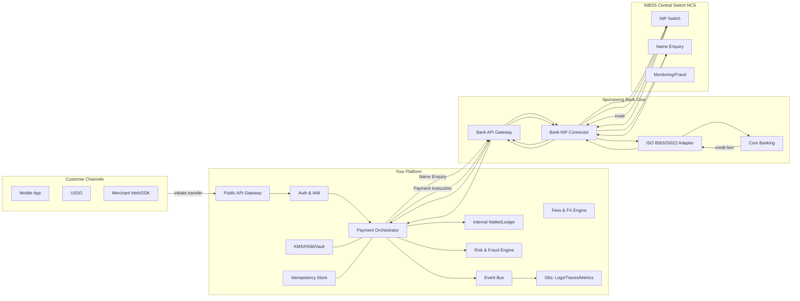
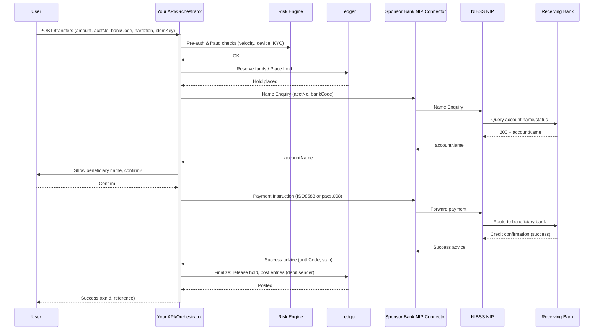

# NIBSS Instant Payments (NIP) — Full Technical Architecture

> This doc gives a production‑grade, end‑to‑end architecture for integrating NIBSS NIP via a sponsoring bank or direct (for licensed FIs). Includes diagrams, sequence flows, API contracts, idempotency/retry, security, monitoring, settlement & reconciliation.

---

## 0) Legend & Assumptions

* **You** = Fintech/PSP Platform
* **SB** = Sponsoring Bank (your direct counterparty)
* **NCS** = NIBSS Central Switch (NIP)
* **CBN‑RTGS** = CBN Real‑Time Gross Settlement (end‑of‑day settlement)
* All calls over mutual TLS; messages are signed; idempotency key used on every payment instruction.
* Message formats: legacy ISO‑8583 (widely used) and/or ISO‑20022 pain/pacs for newer stacks (NPS).

---

## 1) High‑Level Component Diagram



---

## 2) End‑to‑End Sequence (Happy Path)



---

## 3) Error Paths & Reversal Logic (Essentials)

**Common failure modes**

1. **Timeout at RB**: Bank doesn’t respond within SLA (e.g., 15s). → Treat as *unknown*. Keep **hold** on funds, poll Advice/Query Status, or auto‑reverse after T+X minutes if no settlement advice.
2. **Debit success, credit fail**: Your SB returns failure after debit. → Trigger **automatic reversal**; release hold only after reversal confirmation.
3. **Duplicate requests**: Same idemKey re‑sent. → Must be **idempotent**; return prior result.
4. **Name Enquiry mismatch**: Name mismatch above threshold. → Require user re‑confirmation or block.

**Reconciliation strategy**

* Online: immediate status via Advice/Query API.
* EOD: match **your ledger** ↔ **SB file** ↔ **NIBSS report**; investigate exceptions.

---

## 4) API Contract (Gateway Facing Your Clients)

### 4.1 Create Transfer (idempotent)

```http
POST /v1/transfers
Idempotency-Key: 6d5f3b3d-9e7b-4d0a-bf6a-1e2e9f7a0c11
Content-Type: application/json
```

```json
{
  "amount": 125000,
  "currency": "NGN",
  "debtor": {
    "accountNumber": "0123456789",
    "bankCode": "999" // sponsor bank code
  },
  "creditor": {
    "accountNumber": "0987654321",
    "bankCode": "058"
  },
  "narration": "Invoice 4251",
  "customerRef": "INV-4251-2025-08-15",
  "callbackUrl": "https://merchant.example/callbacks/nip"
}
```

**201 Created**

```json
{
  "transferId": "tr_01J7W9...",
  "status": "processing",
  "nameEnquiry": {
    "matchScore": 0.97,
    "beneficiaryName": "ADEBAYO KOLA"
  }
}
```

### 4.2 Confirm Transfer (two‑step UX)

```http
POST /v1/transfers/{transferId}/confirm
```

**200 OK** → `{ status: "submitted" }`

### 4.3 Webhook (Advice)

```json
{
  "event": "transfer.settled",
  "transferId": "tr_01J7W9...",
  "nip": {
    "stan": "123456",
    "rrn": "250815123456",
    "sessionId": "...",
    "responseCode": "00"
  },
  "status": "success",
  "postedAt": "2025-08-15T10:35:12Z"
}
```

---

## 5) Sponsor Bank Edge API (Typical)

### 5.1 Name Enquiry

* **Request**: accountNumber, destinationBankCode
* **Response**: accountName, kycStatus, errorCode

### 5.2 Payment Instruction

* **ISO‑8583 fields (typical)**: MTI 0200, F2 PAN (acct), F3 Processing Code (NIP), F4 Amount, F7 Transmission Date/Time, F11 STAN, F32/33 Acquiring/Forwarding Inst IDs, F37 RRN, F41 Terminal ID, F102/103 Account IDs, F123 POS Data Code, **F128 MAC** (message auth code)

### 5.3 Status/Advice

* Query by RRN/STAN/sessionId; receive final **00** or specific failure code, plus **0210/0430** responses.

### 5.4 ISO‑20022 (NPS)

* `pacs.008` (FIToFICustomerCreditTransfer) for push; `pacs.002` for status; `pacs.004` for returns.
* **Signatures**: XMLDSig; **Transport**: mTLS.

---

## 6) Ledgering Model (Double‑Entry)

**On Confirm (pre‑send)**

* Dr: Customer Available Balance
* Cr: Customer Authorization Hold

**On Success Advice**

* Dr: Customer Authorization Hold
* Cr: Customer Settled Outgoing
* Dr: Your Bank Nostro (mirror)
* Cr: NIP Clearing (memo)

**On Reversal**

* Reverse the above entries atomically; maintain audit trail with immutable event log.

---

## 7) Idempotency & Retry Policy

* **Idempotency‑Key** scope: (debtor acct, creditor acct, amount, narration) for 24–48h.
* **Client‑>You**: Retry **safe** with same key after 30s, 60s, 5m.
* **You‑>Bank**: Use **at‑least‑once** with idempotent reference (RRN/sessionId). Avoid exponential retry storms; back off with jitter.
* **Outbox pattern**: Persist outbound request then dispatch; reconcile via inbox/outbox tables.

---

## 8) Security & Compliance

* **mTLS** with bank; **TLS 1.2+** everywhere.
* **HSM/KMS** for key custody; rotate MAC keys per policy.
* **PCI‑DSS** only if handling PAN/card; still apply ISO‑27001 controls.
* **PII**: BVN/NameEnquiry data minimization, encrypt at rest (AES‑256‑GCM), field‑level tokenization.
* **Strong Auth**: device binding, OTP/SCA for high‑risk transfers.
* **Fraud**: velocity, recipient graph, device fingerprint, geo/behavioural ML.

---

## 9) Observability & Ops

* **Metrics**: auth rate, NE latency, NIP success %, reversal rate, bank SLA breaches, timeout %, duplicate rate, webhook lag.
* **Tracing**: end‑to‑end traceId propagates to bank headers.
* **Logging**: structured JSON; no sensitive fields.
* **Dashboards**: traffic, errors by dest bank, p99 latencies, queue depth.
* **Runbooks**: partial outage (dest bank down) → circuit break to bank, queue and retry later, show user friendly message.

---

## 10) Settlement & Reconciliation

* **T+0 intraday**: online advice forms operational settlement.
* **EOD**: match Your Ledger ↔ Sponsor Bank reports ↔ NIBSS files; auto‑generate exceptions.
* **Disputes**: store all artifacts — ISO messages, signatures, timestamps, network IDs, device IDs.

---

## 11) Negative Scenarios (Design for Failure)

* **Name Enquiry OK but credit fails**: auto‑reverse; inform user; keep audit link to RRN.
* **Beneficiary bank intermittent**: trip breaker; surface specific bank status in UI.
* **Duplicate customer taps**: idemKey + UI disable button + server‑side dedupe window.
* **Webhook missed**: periodic status reconciliation job (RRN list) + dead‑letter queue.

---

## 12) NQR & Pull Payments (Brief)

* **NQR**: customer scans merchant QR → your app initiates NIP push with embedded refs; same advice/settlement flows.
* **Request‑to‑Pay (R2P)** on NPS: merchant sends `pain.013` request; customer authorizes → generates `pacs.008`.

---

## 13) Environment & Testing Checklist

* Obtain **bank sandboxes** for NE, Payment, Status.
* Configure **mTLS**, test cert rollover.
* Simulate: timeouts, duplicate requests, reversal paths.
* Load test to realistic TPS (e.g., 50–500 TPS bursts).
* Run **E2E drills**: daylight saving, clock skew, message signing failures.

---

## 14) Deployment Reference (Cloud‑Native)

* API Gateway (rate‑limit, WAF) → Orchestrator (stateless) → Outbox Queue → Bank Connector Worker(s)
* **Data**: Postgres (ledger), Redis (locks/idempotency), Kafka/NATS (events), S3 (reports/artefacts)
* **Secrets**: Cloud KMS + HSM for MAC keys
* **HA**: Multi‑AZ, blue‑green, chaos testing for partial failures

---

## 15) Artifacts to Collect per Txn

* Our `transferId`, client `customerRef`
* Bank `RRN`, `STAN`, `SessionId`, response code
* Full request/response timestamps (ms), network hops, MAC verification status

---

## 16) UX Guidance

* Always show **beneficiary name** before confirm.
* Clear status: *Processing*, *Successful*, *Reversed*, *Unknown – reconciling*.
* Provide a **shareable receipt** with RRN/STAN.

---

## 17) What to Ask Your Sponsor Bank

* ISO‑8583 or 20022? Which fields required for MAC?
* Name Enquiry SLA and retry policy
* Reversal cut‑offs; advice polling endpoints
* Limit profiles, fraud controls, and circuit breaker guidance
* Reporting format & delivery (SFTP, APIs)

---

## 18) Next Steps

1. Map this blueprint to your stack (Node.js or Go).
2. Stand up the **orchestrator + outbox + idempotency** layers.
3. Implement a **Bank Connector** with pluggable adapters (Mock, Sandbox, Prod).
4. Build dashboards/runbooks; prepare reconciliation jobs.
5. Run sandbox certification with your sponsor bank.
